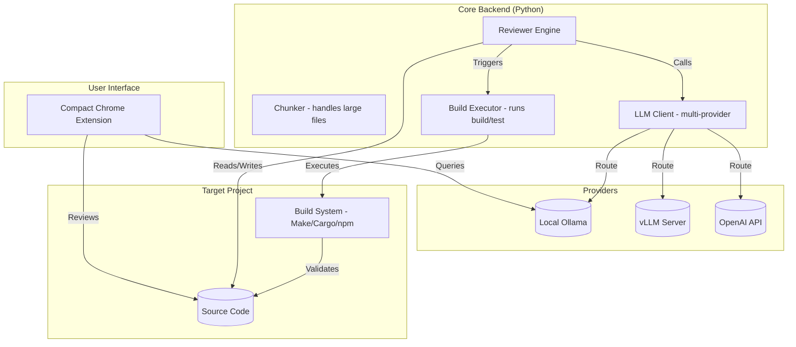

# Compact: Local-First AI Code Review Suite


**Compact** is a comprehensive, local-first AI code review ecosystem designed to provide privacy-preserving, high-quality, and autonomous code analysis. It bridges the gap between manual reviews and automated static analysis by leveraging Large Language Models (LLMs) running locally or in the cloud.

The project consists of two core components:
1.  **Compact Extension**: A Chrome extension for instant GitHub pull request and repository reviews.
2.  **Compact Reviewer Engine**: A powerful Python-based backend that performs deep autonomous reviews, fixes code, and validates changes with your build system.

---

## 🚀 Key Features

### Compact Extension
- **Privacy First**: Integration with local Ollama instances keeps your code on your machine.
- **GitHub Integration**: Direct review of Pull Requests and repository snapshots.
- **Structured Findings**: Generates summaries, actionable suggestions, and next steps.
- **Reporting**: Export detailed review findings as PDF reports.

### Compact Reviewer Engine
- **Hierarchical Analysis**: Reviews at Directory → File → Function granularity.
- **Self-Healing**: Automatically edits source files to fix issues and validates them using your project's build command.
- **Safe Execution**: Only commits changes that pass your build and test suite.
- **Autonomous**: Can run for hours, systematically auditing entire codebases.
- **Provider Agnostic**: Works with any OpenAI-compatible LLM (vLLM, TokenHub, OpenAI, Ollama, llama.cpp).
- **Custom Personas**: Modular "Personas" (Security Hawk, Performance Cop, etc.) allow you to tailor the review focus.

---

## 🏗 Architecture



---

## 📦 Installation & Setup

### 1. Compact Extension
The extension is built with Webpack and Tailwind CSS.

```bash
# Install dependencies
npm install

# Build the extension
npm run build
```

**Loading the Extension:**
1. Open Chrome and navigate to `chrome://extensions`.
2. Enable **Developer mode** (top right).
3. Click **Load unpacked** and select the `build/` folder in the project root.

**Note:** To use with local Ollama, ensure CORS is configured:
```bash
# Set environment variable
OLLAMA_ORIGINS="chrome-extension://*"
# Restart Ollama
```

### 2. Compact Reviewer Engine (Python)
The engine requires Python 3.8+ and a running LLM provider.

```bash
cd "code reviewer"

# Install dependencies
make check-deps

# Initialize configuration
make config-init
```

---

## ⚙️ Configuration

The Reviewer Engine is configured via `config.yaml`. A sample is provided in `config.yaml.sample`.

```yaml
llm:
  providers:
    - url: "http://localhost:11434" # Local Ollama
    - url: "https://api.openai.com"
      api_key: "sk-..."           # Cloud Fallback

source:
  root: ".."                      # Path to project to review
  build_command: "make -j$(nproc)" # Your build/test command
  build_timeout: 600

review:
  persona: "personas/security-hawk" # Choose your auditor
```

---

## 🤖 Reviewer Personas

Compact uses the **Oracle Agent Spec** for defining review personalities. Current personas include:

| Persona | Focus | Best For |
| :--- | :--- | :--- |
| **Security Hawk** | Vulnerabilities, exploits, and OWASP | Security-critical code |
| **FreeBSD Angry AI** | POSIX compliance, kernel style | System-level C code |
| **Performance Cop** | Algorithms, memory management | Optimization tasks |
| **Friendly Mentor** | Readability, best practices | Onboarding and learning |

---

## 🛠 Technical Stack

- **Frontend**: Javascript, HTML, Vanilla CSS (with Tailwind for extension), Webpack.
- **Backend**: Python 3.8+, PyYAML, Asynchronous I/O.
- **LLM Integration**: OpenAI-compatible API Protocol.
- **Project Management**: [Beads (bd)](https://github.com/steveyegge/beads) for issue tracking.

---

## 🚧 Known Issues & Troubleshooting

### Extension: "Ollama Connection Failed"
This is typically a CORS (Cross-Origin Resource Sharing) issue. By default, Ollama blocks requests from browser extensions.
- **Fix**: Set `OLLAMA_ORIGINS="chrome-extension://*"` as an environment variable and **fully restart** the Ollama service.
- **Verification**: You can check if it's working by opening the extension popup, right-clicking, selecting **Inspect**, and checking the console for 403 errors.

### Extension: Large PR Timeouts
Very large Pull Requests (20+ files or 10,000+ lines changed) may hit the Ollama or GitHub API timeout limits.
- **Workaround**: Currently, the system limits the characters per file to 4,000 to mitigate this. For extremely large PRs, we recommend using the **Compact Reviewer Engine** (Python) which handles large-scale chunking more gracefully.

### Extension: Risk Score engine
The current risk score engine uses a seeded random generator (1-15 range) for management purposes. This ensures that the same review text consistently produces the same score while preventing "alert fatigue" from constantly high scores.

---

## 🤝 Contributing


We welcome contributions! Please see `CONTRIBUTING.md` in the `code reviewer` directory for detailed guidelines on adding new features or personas.

## 📄 License

This project is licensed under the Apache License 2.0 / MIT License. See `LICENSE` for details.